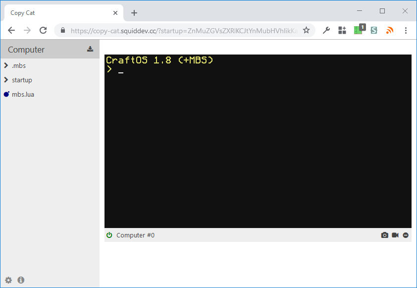
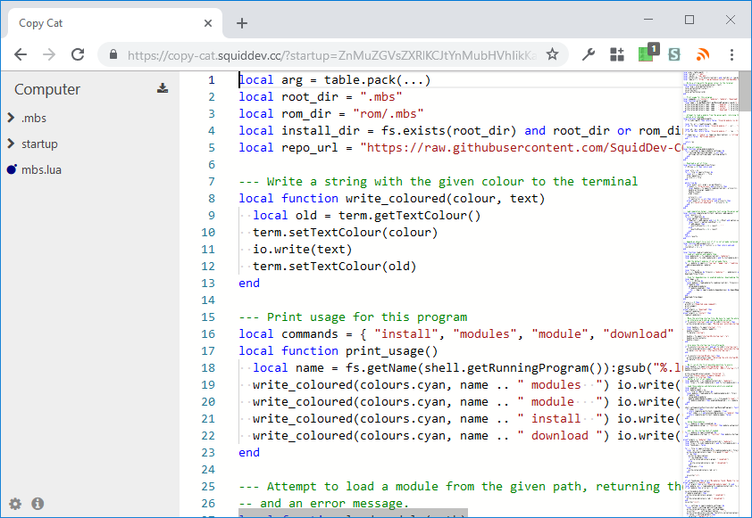

# Copy Cat

[Copy Cat][copycat] is a ComputerCraft emulator for the web, heavily inspired by
the a similar project [Mimic][mimic]. However, unlike Mimic, it's built from the
mod's source code - ensuring that it's always <sup>1</sup> as accurate as
possible.

The interface is essentially the same as [Cloud Catcher][cloud], but with the
computer running right in your browser rather than a server!

---

<sup>1.</sup> While we try to keep as close as we can, there are some elements
which are impossible to emulate due to the restricted environment of a browser.

For instance, the `http` API has been entirely recreated, and some functionality
(such as setting specific headers or requesting some sites) is not possible. As
with any emulator, there will be subtle differences in how input events (key
presses, mouse clicks, etc...) are handled, so do not rely on our behaviour.

And yes, this disclaimer was longer than the actual description.

## Screenshots




## Embedding
It's possible to embed copy-cat within another website. This may be useful if
you want to show off your programs on their own site.

```html
<!-- The div to embed your computer. Can be placed anywhere within the page. -->
<div id="embed-computer"></div>

<!-- Any requirejs-compatible loader (https://requirejs.org/) will work. -->
<script type="text/javascript" src="https://copy-cat.squiddev.cc/require.js"></script>

<script>
  // Tell requirejs to load copycat/* from the website.
  require.config({ paths: { copycat: "https://copy-cat.squiddev.cc/" } });
  // Find our #embed-computer element and inject a computer terminal into it.
  require(["copycat/embed"], setup => setup(document.getElementById("embed-computer")));
</script>
```

The setup function also accepts several arguments, which are demonstrated in
[this example](src/web/example/index.html).

## Build it yourself
Due to the nature of this project, Copy Cat has a rather strange build setup. We
take sources of [Cobalt][cobalt] and [CC: Tweaked][cct], modify them to work in
a Javascript environment, and then compile them to JS. Thankfully, this is all
automated by Gradle. However, it does require a bit of setup:

Before getting started, you will need the JDK (Java Development Kit), and NodeJS
installed and on the path.

 - Clone Copy Cat with submodules: `git clone --recursive https://github.com/SquidDev-CC/copy-cat`
 - Install NodeJS packages: `npm install`
 - Apply patches: `./gradlew applyPatches`
 - Build: `./gradlew assemble`. You can also automatically build everything when
   a file changes using `./gradlew assemble --continuous`.

The resulting website should be in `build/web`.

If making further modifications to the files in `src/main/java`, run
`./gradlew makePatches` to regenerate the patch directory.

Use `git submodule foreach git pull` in order to update all source repositories.
You will probably need to apply and then regenerate patches after doing so.

[copycat]: https://copy-cat.squiddev.cc "Try Copy Cat online"
[mimic]: https://gravlann.github.io/ "The Mimic ComputerCraft emulator"
[cloud]: https://github.com/SquidDev-CC/cloud-catcher "The Cloud Catcher repository"
[cobalt]: https://github.com/SquidDev/Cobalt "The Cobalt repository"
[cct]: https://github.com/cc-tweaked/CC-Tweaked "The CC: Tweaked repository"
